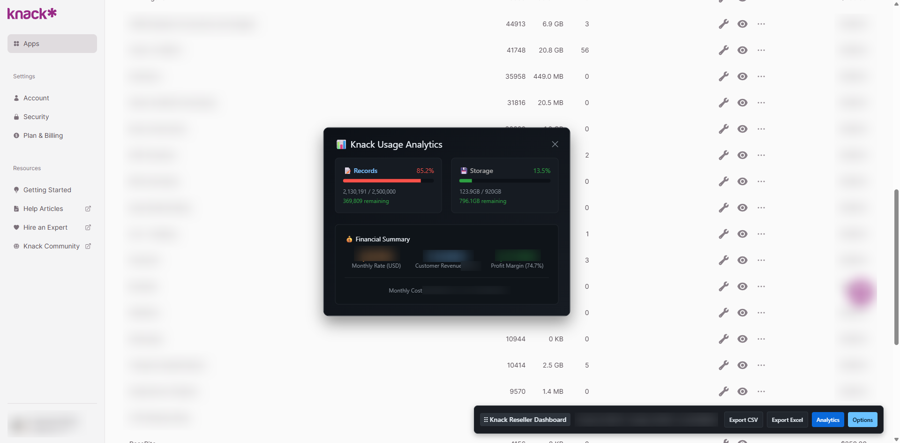

# Knack-Reseller-Dashboard
 Knack Reseller Dashboard - Client Management &amp; Billing Made Easy    Transform your Knack reselling business with powerful analytics and automated billing tools designed specifically    for Knack partners and resellers.

📊 Knack Reseller Dashboard - Client Management & Billing Made Easy

  Transform your Knack reselling business with powerful analytics and automated billing tools designed specifically
   for Knack partners and resellers.

   

  🎯 Key Features:
  • Client Usage Tracking - Monitor each client's record count and storage usage in real-time
  • Automated Cost Calculation - Tiered pricing with configurable rates per client
  • Profit Analytics - Track margins, revenue, and costs with visual dashboards
  • Usage Limits Monitoring - See how close you are to Knack plan limits (records/storage)
  • Export Reports - Generate CSV/Excel reports for billing and client communications
  • Configurable Pricing - Set custom rates, overrides, and pricing tiers
  • Multi-Currency Support - Handle USD/NZD conversions and GST calculations

  💼 Perfect For:
  - Knack resellers managing multiple client accounts
  - Digital agencies offering Knack solutions
  - Consultants billing clients based on usage
  - Anyone needing detailed Knack usage analytics

  🚀 How It Works:
  1. Install the extension and configure your Knack plan details
  2. Set up pricing tiers and client-specific rates
  3. Visit your Knack dashboard - usage data appears automatically
  4. Use the Analytics panel to view profit margins and capacity
  5. Export detailed reports for billing and client management

  ⚙️ Fully Configurable:
  - Your monthly Knack costs and plan limits
  - Exchange rates for international billing
  - Tiered pricing structures
  - Client-specific pricing overrides
  - Currency symbols and GST settings

  🔒 Privacy & Security:
  - All data stays local in your browser
  - No external servers or data collection
  - Works exclusively with your existing Knack dashboard

  Streamline your Knack reselling business and maximize profitability with automated usage tracking and intelligent
   billing management.

  ---
  Author: Phil Wesley-Brown @wasabi.digitalVersion: 0.3.0Compatible with: Knack dashboard (dashboard.knack.com)
